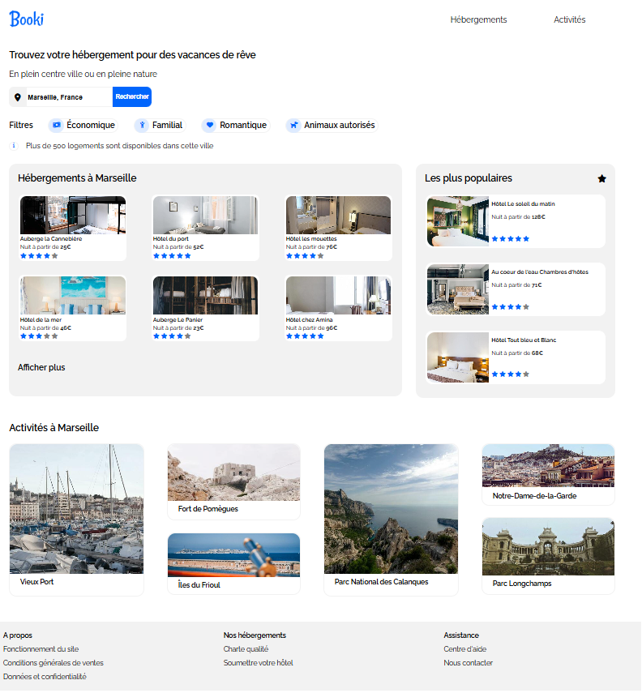

# 🌐 Booki

**Projet 2 - Formation OpenClassrooms : Développeur Web**  
**Intégration d'une maquette Figma responsive pour un site de planification de vacances**  

---

## 🎯 Objectifs du projet

- 🔧 Intégrer une maquette Figma en HTML/CSS fidèle au design fourni  
- 💡 Utiliser uniquement HTML5 et CSS3 (Flexbox / Grid)  
- 🧱 Respecter les bonnes pratiques de structuration et de validation W3C  

---

## 🛠️ Technologies utilisées

- HTML5  
- CSS3  
- Flexbox / Grid  
- Git & GitHub  

---

## 🖼️ Aperçu du projet

  
<!-- Mettre ici la capture d'écran réelle du projet -->

---

## 📱 Responsive Design

Le site est responsive et adapté aux supports :
- 📱 Mobile
- 💻 Ordinateur
- 🧾 Valide W3C HTML & CSS

---

## 🔗 Lien du site en ligne

👉 Vous pouvez consulter le site déployé ici :  
[Booki sur GitHub Pages](https://saumia-code.github.io/Booki/)

---

## ✅ Fonctionnalités principales

- ✅ Affichage dynamique des hébergements et activités selon la ville choisie (design statique)  
- ✅ Filtrage par catégories avec boutons interactifs (sans JS)  
- ✅ Mise en page responsive adaptée aux différents écrans  

---

## 📚 Ressources utilisées

- Visual Studio Code  
- Figma (maquette du projet)  
- [Documentation HTML5](https://developer.mozilla.org/fr/docs/Web/HTML)  
- [Documentation CSS3](https://developer.mozilla.org/fr/docs/Web/CSS)

---

## 👩‍💻 Auteur

**Soumia Bouizran**  
📧 Contact : [votre email]  
🔗 GitHub : [https://github.com/saumia-code](https://github.com/saumia-code)
